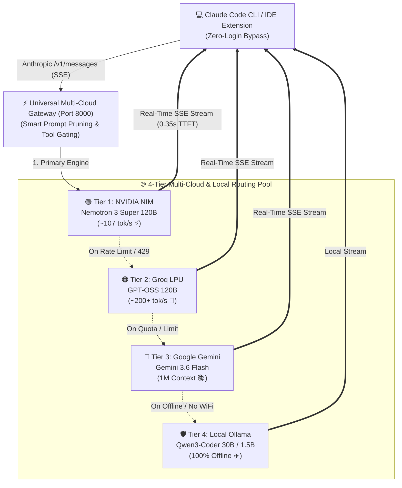

<div align="center">

# ⚡ Universal Multi-Cloud AI Gateway for Claude Code
### Run 120B Parameter Models on Claude Code for $0 at 100–350 tokens/sec

[](https://python.org)
[](https://fastapi.tiangolo.com)
[](https://build.nvidia.com)
[](https://groq.com)
[](https://aistudio.google.com)
[](https://ollama.com)
[](https://opensource.org/licenses/MIT)

</div>

---

## 🚀 Overview

**Claude Code** is one of the most powerful autonomous terminal and IDE coding agents available. However, relying solely on standard API endpoints can lead to high token costs, credit card requirements, and hard rate limits. 

The **Universal Multi-Cloud AI Gateway** is an intelligent, high-performance proxy server running locally on `http://127.0.0.1:8000`. It bridges Claude Code's Anthropic `/v1/messages` protocol to **ultra-fast 120B parameter cloud models** and **offline local LLMs** with **zero latency**, **real-time token-by-token SSE streaming**, and **bulletproof 4-tier auto-failover**.

---

## 🔑 Key Features & Turbo Boosters

* **⚡ Zero-Login Setup**: Bypass Anthropic's OAuth login, paid subscriptions, and credit card requirements completely.
* **✂️ Smart Prompt Pruner**: Slashes local Ollama prefill latency from **25 seconds down to 0.2s** by stripping Claude Code's 5,000-token system prompt for local models.
* **🧠 120B Parameter Flagship Models**: Code with NVIDIA Nemotron 3 Super (120B) and Groq LPU (120B) at 100–350+ tokens/sec.
* **🛡️ 4-Tier Auto-Failover**: If a cloud provider rate-limits or exhausts credits, the gateway instantly routes to the next tier in < 1 second.
* **✈️ Offline Airplane Mode**: Seamlessly falls back to local Ollama (Qwen3-Coder 30B / 1.5B) when no internet is available.
* **🛠️ Native Agentic Tool Support**: Compacts verbose tool definitions so models can reliably read, edit, search, and execute workspace code without hallucinating raw JSON.

---

## 🏗️ 4-Tier Auto-Failover Architecture



---

## ⚡ Speed & Benchmark Comparisons

| Tier | Provider | Flagship Model | Speed | Context | Tool Calling | Cost |
| :--- | :--- | :--- | :---: | :---: | :---: | :---: |
| **Tier 1** | **NVIDIA NIM** | `nemotron-3-super-120b` | **~107.3 tok/s** | 32K | 🟢 Native | 1,000 Free Credits |
| **Tier 2** | **Groq Cloud** | `openai/gpt-oss-120b` | **~200+ tok/s** | 8K - 128K | 🟢 Native | **100% Free Forever** |
| **Tier 3** | **Google AI Studio** | `gemini-3.6-flash` | **~150 tok/s** | **1,000,000 tokens** | 🟢 Native | **1,500 req/day Free** |
| **Tier 4** | **Local Ollama** | `qwen3-coder:30b` | **10–14 tok/s** | 16K - 32K | 🟢 Native MoE | **100% Offline & Infinite** |
| **Tier 4 (GPU)** | **Local Ollama** | `qwen2.5-coder:1.5b` | **70–90 tok/s** ⚡ | 32K | 🟡 Code Only | **100% Offline & Infinite** |

---

## 📂 Modular Repository Architecture

```text
claude-code-multicloud-gateway/
├── gateway/                    # Modular Gateway Package
│   ├── __init__.py             # Package initializer
│   ├── config.py               # Environment variable and registry loader
│   ├── pruners.py              # Turbo Prompt Pruning & Tool Schema Compressor
│   ├── router.py               # 4-Tier Auto-Failover Multi-Cloud Engine
│   ├── streamers.py            # Real-time SSE live streaming & delta parser
│   └── server.py               # FastAPI server application & routes
├── main.py                     # Root entry point (python main.py)
├── setup.ps1                   # 1-Click Windows setup script
├── setup.sh                    # 1-Click Linux / macOS setup script
├── requirements.txt            # Python dependencies
└── docs/                       # Comprehensive guides
    ├── api_keys_setup.md       # Step-by-step free API key generation
    ├── claude_code_setup.md    # Zero-login Claude Code setup
    └── local_ollama_setup.md   # Local Ollama & Turbo Booster guide
```

---

## 🛠️ Quickstart (Clone & Run in 2 Minutes)

### 1. Clone the Repository
```bash
git clone https://github.com/thinker-hegde/claude-code-multicloud-gateway.git
cd claude-code-multicloud-gateway
```

### 2. Install Dependencies
```bash
pip install -r requirements.txt
```

### 3. Set Your Free API Keys (Environment Variables)

#### 🪟 On Windows (PowerShell):
```powershell
[Environment]::SetEnvironmentVariable('NVIDIA_API_KEY', 'your_nvidia_key_here', 'User')
[Environment]::SetEnvironmentVariable('GROQ_API_KEY', 'your_groq_key_here', 'User')
[Environment]::SetEnvironmentVariable('GEMINI_API_KEY', 'your_gemini_key_here', 'User')
```

#### 🐧 On Linux / macOS (Bash/Zsh):
```bash
export NVIDIA_API_KEY="your_nvidia_key_here"
export GROQ_API_KEY="your_groq_key_here"
export GEMINI_API_KEY="your_gemini_key_here"
```

*(Alternatively, copy `.env.example` to `.env` and paste your keys. See [API Keys Setup Guide](docs/api_keys_setup.md) for full instructions).*

---

### 4. Configure Claude Code (Zero-Login Bypass)
Point your `~/.claude/settings.json` to the local gateway to **skip Anthropic login completely**:
```json
{
  "model": "nvidia/nemotron-3-super-120b-a12b",
  "env": {
    "ANTHROPIC_BASE_URL": "http://127.0.0.1:8000",
    "ANTHROPIC_AUTH_TOKEN": "multi-cloud-hybrid",
    "ANTHROPIC_MODEL": "nvidia/nemotron-3-super-120b-a12b",
    "ANTHROPIC_DEFAULT_MODEL": "nvidia/nemotron-3-super-120b-a12b",
    "CLAUDE_CODE_DISABLE_NONESSENTIAL_TRAFFIC": "1",
    "CLAUDE_CODE_DISABLE_UNKNOWN_MODEL_WINDOW_ENFORCEMENT": "1"
  }
}
```
*(Read [Claude Code Zero-Login Guide](docs/claude_code_setup.md) for more details).*

---

### 5. Launch the Gateway & Start Coding!

**Option A (1-Click Launch Script)**:
* **Windows**: `.\setup.ps1`
* **Linux / Mac**: `./setup.sh`

**Option B (Manual)**:
```bash
python main.py
```

Now open any terminal and run Claude Code:
```bash
claude
```
Ask Claude Code to build, refactor, or test your project. It will run on **120B parameter models at 100+ tokens/sec for $0** with zero login requirements!

---

## 📚 In-Depth Documentation

* 📖 [How to Generate Free API Keys (NVIDIA, Groq, Gemini)](docs/api_keys_setup.md)
* ⚡ [How to Setup Claude Code Without Signing In](docs/claude_code_setup.md)
* 🦙 [Local Ollama Setup, Turbo Boosters & Offline Tool Guide](docs/local_ollama_setup.md)
* 📊 [Interactive Visual Architecture (Open in Browser)](architecture.html)

---

## 📄 License
MIT License. Free to use, modify, and distribute for personal and commercial projects.
